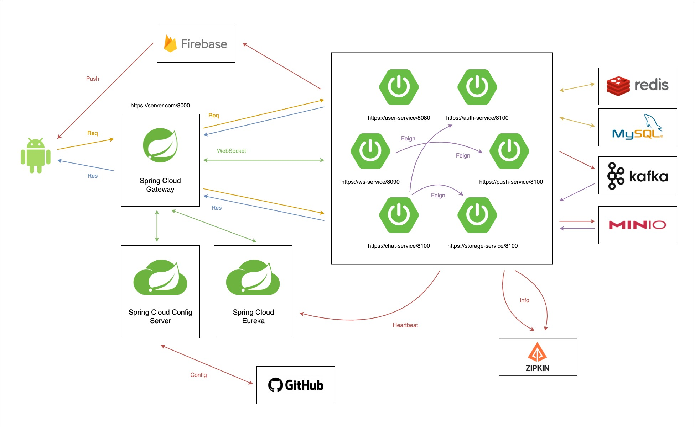
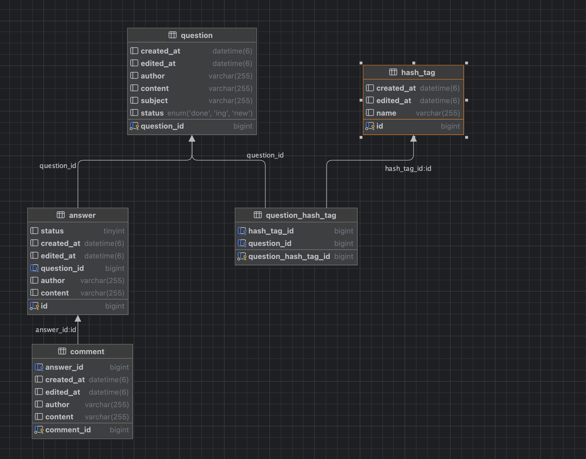
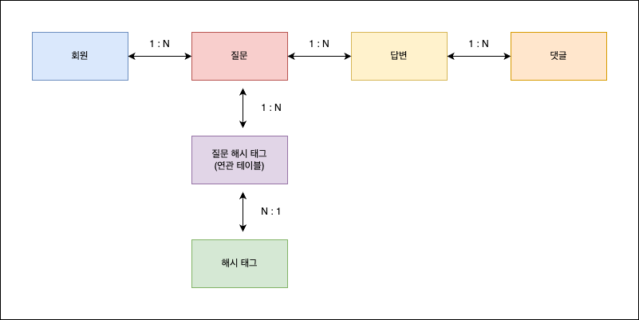
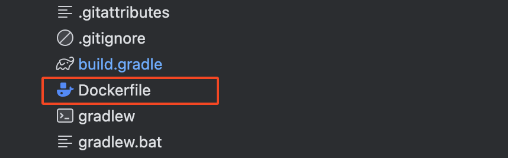
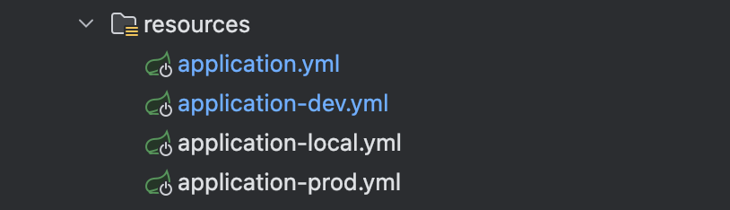
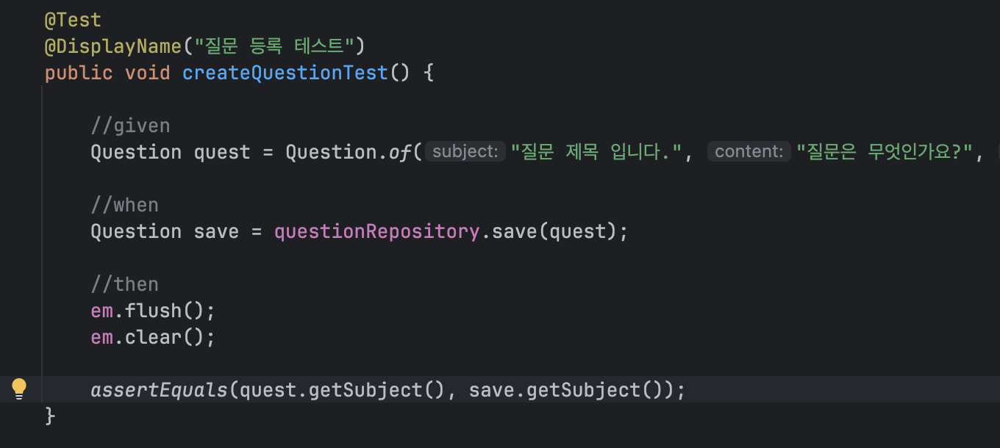
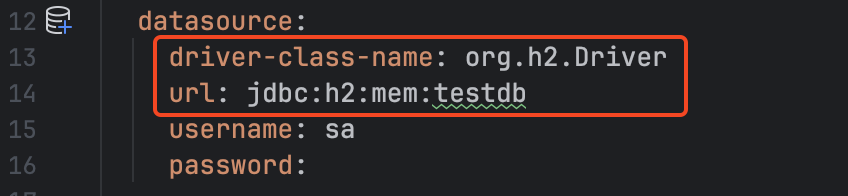
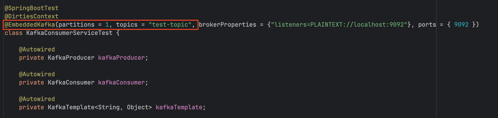

# 프로젝트 설계

본문서는 진행할 프로젝트의 설계 내용에 대해서 작성되었습니다.

## 1. 요구 사항 정리 & 분석

### 1.1. 기본 요구 사항
* 최소 기능
    * 질문 작성 및 수정 (사용자가 질문을 작성하고 수정)
    * 답변 작성 (질문에 답변 작성)
* 추가 기능:
    * 답변 채택 기능 (질문에 답변을 채택할 수 있음)
    * 질문/답변 검색 (제목만 검색)
    * 답변에 댓글 작성 (답변에 대한 댓글 기능)
    * 질문/답변 신고 기능 (부적절한 질문이나 답변 신고)
    * 태그 기능 (질문에 태그 추가)
    * 좋아요/추천 기능 (답변에 좋아요 기능 추가)
    * 질문/답변 필터링 및 정렬 (최신, 인기 등으로 정렬)
    * 리워드 및 포인트 시스템 (답변 채택 시 포인트 지급)

### 1.2. 요구 사항 분석
* 질문 & 답변에 대한 읽기 기능은 모든 사용자가 가능
* 질문 & 답변에 대한 쓰기 기능은 사용자 인증이 완료된 이후에 가능
* 질문은 코어 데이터로 모든 데이터는 질문을 중심으로 구성된다. (우선은 회원은 제외)

### 1.3. 요구 사항 분석 및 설계

질문 : 답변은 1대다의 관계를 가진다.
* 질문과 답변은 상태를 가진다.
    * 질문 - 신규, 진행중, 완료
    * 답변 - 채택, 미채택

답변 : 댓글은 1대다의 관계를 가진다.
- 답변의 댓글에 대해 대댓글 기능은 가능 하면 지원하도록 한다.

질문 : 해시 태그(태그)는 다대다의 관계를 가진다. (단 1대다, 다대1로 처리한다)
- 해시 태그를 통한 질문 모아보기 기능등을 제공한다.

질문은 페이징 처리 & 검색 & 정렬의 기능을 제공한다.

- 검색은 질문 제목, 질문 내용, 질문 작성자로 검색 가능
- 정렬은 날짜순, 답변 많은순, 추천순 등을으로 정렬한다.

## 2. 아키텍쳐 설게

### 2.1. MSA (Micro Service Architecture)



위의 구조는 참고용 MSA 구조이다. (Hexagonal architectur)  
플랫폼 서비스/기능 서비스/인프라를 구분해서 보도록 한다.

### 2.2. 질문/답변 서비스의 구성

구동 플랫폼의 사양을 정확히 측정 하기 어려우므로 최초 서비스 구성은 질문/답변 서비스 하나로 구성한다.  
질문 답변의 기본 스펙인 인증된 사용자만 write가 가능  
회원 서비스와 질문/답변 서비스는 분리 하기로 결정한다.

같은 DB를 사용한다고 하면 별도의 요청없이 회원의 정보 조회가 가능  
그러나 회원 서비스는 회원 DB를 사용하고   
질문/답변 서비스는 질문/답변 DB를 사용하는 경우를 고려 해야한다.   
그래야 회원 서비스에 장애가 발생하더라도 질문/답변 서비스는 정상 동작 한다.

여기서 두가지 방법이 필요하다.
1. 질문/답변 서비스에서 회원 서비스의 정보를 조회한다.
2. 질문/답변 서비스에 회원 정보를 중복으로 저장한다. (필요한 정보만 저장)

1은 필요에 따라 요청을 통해 데이터를 전달받는다.  
2에서 중복 데이터를 관리하는 방법은 회원 정보의 변경이 발생하는 경우   
회원 서비스 -> 질문/답변 서비스 데이터 변경 이벤트를 발생시키는 것이다. (ex. 메세지 큐, CDC)  
질문/답변 서비스는 해당 이벤트를 구독하고 있다가 필요한 정보만 갱신 하여 동기화 한다.  
단, 이방법은 이벤트 발생 시점까지 데이터 동기화 완료까지 시간이 필요 할 수 있다.

### 2.3. 플랫폼 서비스 구성

* API Gateway
    * FE/BE간 모든 통신은 API Gateway를 거친다.
    * 모든 인증은 API 게이트 웨이에서 처리한다.
    * Jwt를 이용한 sessionless한 인증을 사용한다.
    * 스케일 아웃된 상황에서 Service Discover를 통해 로드 밸런싱 수행
    * Rate Limit을 이용한 부하 방지 & 플랜별 api 한도 재한
* Service Discovery
    * API 게이트 웨이등에서 각 서비스의 정보를 조회
    * 각 서비스느는 Discovery로 자신의 정보를 전송한다.
* 스토리지 서비스
    * 서비스 전체의 파일 업로드, 다운로드를 수행한다.
    * s3, minio같은 확장, 복구, 클러스터 구성이 가능한 인프라를 이용한다.
* Config Service
    * 각 서비스에서 사용하는 설정 정보를 저장
    * 설정 정보 변경시 actuator를 이용해 각 서비스에 변경 내용을 전파

### 2.4. 기타 서비스

* 백오피스
    * 관리자만 접근 가능한 서비스로 기능 서비스에서 수행이 불가능한 작업을 수행한다.

## 3. 데이터 베이스 설계

### 3.1. 테이블간 연관관계 및 설계 정리

질문 : 답변은 1대다의 관계를 가진다.
* 질문과 답변은 상태를 가진다.
    * 질문 - 신규, 진행중, 완료
    * 답변 - 채택, 미채택

답변 : 댓글은 1대다의 관계를 가진다.
- 답변의 댓글에 대해 대댓글 기능은 가능 하면 지원하도록 한다.

질문 : 해시 태그(태그)는 다대다의 관계를 가진다. (단 1대다, 다대1로 처리한다)
- 해시 태그를 통한 질문 모아보기 기능등을 제공한다.

질문은 페이징 처리 & 검색 & 정렬의 기능을 제공한다.

- 검색은 질문 제목, 질문 내용, 질문 작성자로 검색 가능
- 정렬은 날짜순, 답변 많은순, 추천순 등을으로 정렬한다.

인덱스 전략
- 기본키 활용
- 서비스의 특성과 카디널리티를 비교하였을때 추가 인덱스를 통한 쿼리 튜닝 진행 (예정)

### 3.2. ERD



### 3.3. 테이블 연관관계



## 4. 기술 스택

최소 사용 기술
* OpenJDK 21 이상
* Spring boot 3.x 버전
    * JPA, QueryDSL, Spring Cloud 등
    * MyBatis와 같은 SQL Mapper는 사용하지 않고 ORM(JPA)만 사용 한다.
* Mysql 8.x 이상 버전

추가 인프라
* AWS
    * ec2
    * s3
* Reids
    * 구성이 가능하다면 클러스터 구성
* Kafk
    * 구성이 가능하다면 zookeeper를 이용한 클러스터 구성
* minio, ceph
    * AWS s3 사용이 불가능 하다면 필요
* 모니터링
    * grafana, prometheus, 가능 하다면 cloud watch

사용 희망 (가능 하다면 MSP 사용)
* AWS
    * ECS or EKS
    * Elastic Cache
    * S3
    * MSK
    * SES
    * DynamoDB
    * Aurora
    * OpenSearch

API
* Rest API
    * FE/BE 통신에 사용
    * FE는 BE 서비스와 직접 통신하지 않는다.
    * FE/BE간 모든 통신은 Gateway를 통해 처리한다.
* Websocket
    * 실시간 데이터 처리에 사용하도록 한다.
    * ex. 랭킹 시스템 등
* Grpc
    * 내부 통신용으로만 사용
    * protobuf를 submodule로 관리 한다.
* GraphQL
    * 대시보드등의 구성이 필요하면 사용하도록 한다.

미정
* golang
* nodejs (next js, type orm)
* FE
    * react
    * vue js
    * valina js를 통한 mvc 구조는 사용하지 않는다.

## 5. 배포 방법

### 5.1. 배포 단위

기본적으로 서비스는 도커 이미지를 통해 배포 한다.   
다음과 같이 도커 파일을 통해 빌드 서버에서 빌드 하여 이미지 저장소에 업로드 한다.



`.env` 파일을 통해 인프라의 구성 정보 (ex. 아이피)가 변경되더라도 서비스의 수정이 없도록 한다.  
환경 변수 파일을 변경하여 서비스 재구동하여 적용이 가능하도록 구성한다.

### 5.2. 빌드

github action 또는 jenkins를 통해 빌드 & 배포 하도록 한다.

## 6. 테스트

### 6.1. 환경 분리



프로필 분리를 통해 구동되는 환경의 나누도록 한다.
* develop
    * 개발 서버가 존재한다면 개발 서버 인프라 사용
* local
    * 개발자 환경 (로컬) 환경에서 사용
* prod
    * 실제 product 환경에서만 사용

### 6.1. 단위 테스트

기본적으로 테스트 코드의 작성 방법은 `given` `when` `then` 패턴을 따르도록 한다.  


mocking은 최소화 한다.   
mocking은 외부 서비스 또는 인프라의 변경이 영향이 있는 경우만 한다. (aws api 사용 하는 경우 등)   
예를 들어 파일 업로드가 존재하는 비즈니스 로직에서 테스트 마다 파일을 업로드 할수 없으므로 mocking 수행



가능한 경우 다음과 같이 in-memory db를 통해 테스트 수행 한다.  
redis, kafka등도 테스트를 위한 embedded 형태를 제공하니 사용시 참고 하도록 한다.



### 6.2. API 테스트

Postman의 workspace를 생성후 모든 api의 테스트 케이스를 작성한다.
또는 IntelliJ 의 .http를 이용한 api 테스트 케이스를 작성하도록 한다.   
후자의 방법이 프로젝트 내에 테스트 파일이 존재하므로 버전관리가 더 쉬운것으로 보인다.

## 7. 브랜치 전략

깃플로우 전략을 사용한다.

`master`, `develop`, `release`, `feature` 브랜치를 사용하며 용도는 다음과 같다.

* master
    * 릴리즈 후 이 브랜치에 release 브랜치를 머징 한다.
    * 태깅을 통해 각 버전을 관리한다.
    * 필요 하다면 `hotfix` 브랜치는 여기서 생성하도록 한다.
* develop
    * 주로 개발기간에 feature 브랜치가 머징되는 브랜치
    * 개발자는 Pull Request를 이 브랜치에 진행 한다.
* release
    * 배포 용도로 사용하는 브랜치
    * 버전등의 수정만을 처리한다.
* feature
    * 개발자의 작업을 기능 단위로 쪼갠 브랜치
    * 개발자는 작업 후 해당 브랜치를 push한다
    * develop 브랜치로 Pull Reqeust를 생성한다.

커밋 컨벤션

```
Feat: "로그인 관련 api 추가"

회원 로그인 api 추가
  - oauth 기반 로그인 코드 추가
  - 로그인시 패스워드 암호화 처리 로직 추가

Resolves: #321
Ref: #456
Related to: #391, #312
```

첫번째줄 - 태그 이름 작성 [Feat|Fix|Mod|Refactor|Docs|Test] 및 간랸한 내용 작성  
두번쨰줄 - 자세한 작업 내용 기록  
세번째줄 - 수정시 해결 버전, 참조 버전, 관련 버전 (버전은 깃허브 풀리퀘스트 넘버링)


## 8. 코드 리뷰 & API 문서 작성

### 8.1. 코드 리뷰

코드 리뷰는 Pull Request 생성후 파트 원을 필수 리뷰어로 등록 한다.  
코드 리뷰가 완료되면 머징을 진행하도록 한다.  
Commit시 트리거를 통해 자동 빌드가 수행되도록 하며, 빌드시에 단위 테스트를 진행한다.  
단위 테스트에 fail 하면 빌드가 실패 하도록 구성한다.


### 8.2. API 문서화

Rest API의 경우 기본적으로 표준을 준수한다.  
url, http method, header, body, response, http code등을 필수적으로 포함한다.   
가능 하다면 샘플 요청 값, 응답 값을 같이 포함하도록 한다.


## 9. 애자일

### 9.1. 스크럼

스토리 포인트 설정을 통한 개발 업무의 세분화   
스크럼 마스터는 일정 조율 & 스토리 포인트 조정을 통해 일정을 산정 한다.  
작업전 스크럼 진행, 작업 완료 후 스프린트 회고 진행   
(ex. 일일 단위 스크럼, 주 단위 회고)

### 9.2. 회의

불필요한 회의는 최소화 한다.   
스펙 설정 회의, 설게 회의, 핫픽스 회의를 제외한 회의는 진행하지 않는다.  
가능 하다면 스크럼 시간에 의논 & 결정 하도록 한다.  
